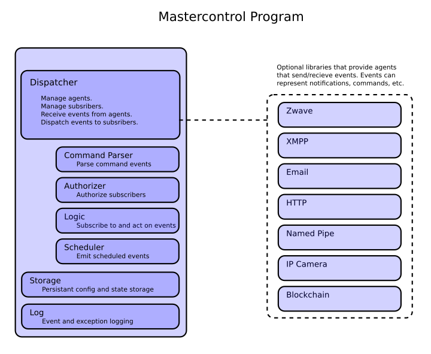

# Master Control

## About
Master Control, Master Control Program, or MCP, is a multi-threaded and event driven platform for managing and integrating various agent modules.

## Background
I started this project as a way to learn more about home automation and Python using the python-openzwave library. Eventually I started integrating other functionality, such as XMPP messaging and command processing, and started thinking about ways to make the code more modular. I decided on the event queue/dispatcher structure you see now and moved all external functionality into agent modules. 

## Core Structure

The core of MCP has a few basic duties
* Manage agents
* Manage event subscriptions
* Receive events from agents
* Dispatch events to subscribers

Core functionality is broken into seperate libraries in the 'lib' directory, see the description of each below. 
See the following graphic that shows the original structural design:

## Configuration

The configuration for MCP is place in the 'etc/mcp.conf' YAML file.
Each agent needs to be explicitly enabled in the 'agent:' section, see the description of each below.

User accounts and alert levels are defined in the 'user:' section.

    user:
        user1:
          email:
            address: user1@DOMAIN 
            level: none
          xmpp:
            address: user1@DOMAIN
            level: alert
        user2:
          email:
            address: user2@DOMAIN
            level: alert
          xmpp:
            address: user2@DOMAIN
            user level: debug

## Core Libraries

### lib/command.py

This core library provides command registration, parsing and processing.
Other components register commands either with the add method or through a command register event.

### lib/event.py

This core library defines the event object. 
Events are the main means of communication between agents and the mcp core. 
*NOTE: The structure of this object has not been finalized.*

#### Event types
An event can represent a subscribe/unsubscribe request, a message, usermessage or command.
A subscribe request can be used to match other events or event emitters using using specific agent or event ids or regular expressions.
A message event is for passing a message string between agents/components.
A usermessage event is to represent a message send on behalf of a user.

### lib/schedule.py

This core library provides mechanisms to schedule events in the future with several different time specifications.
See timetools for more information on ways to specify time.

### lib/timetools.py

This core library contains functions for converting and making calculations with time specifications in various formats.

## Agents

Agents provide functionality and communicate by emitting and receiving events.
Agents are enabled and configured in 'agent:' section of the mcp.conf configuration file.

### inotify

This agent uses the Linux inotify subsystem to watch for filesystem changes and then send MCP events.

#### Configuration Information

Specify a unique instance ID and one or more file or directories to watch.

#### Example Configuration

    inotify:
      instanceid: inotify-camera1
      watch: 
        - /cameras/camera1/
      enabled: True 

### openzwave

This agent uses the python-openzwave library to connect to a USB Zwave controller and replicates Zwave events into MCP and vice versa.

#### Configuration Information

1. device - a Zwave controller device
2. config_path - location of the python-openzwave system wide configs
3. convertctof - convert temperatures from celcius to farenheit for nodes that only support celcius
4. nodes - give descriptive names to Zwave nodes, I use the 'NAME - LOCATION' format
 
#### Example Configuration

    openzwave:
      device: /dev/zwave
      config_path: '/usr/local/lib/python2.7/dist-packages/python_openzwave/ozw_config' 
      convertctof: True
      nodes:
        1:
          name: Controller
        2:
          name: Thermostat
        4:
          name: RGB Light - Porch
        7:
          name: Motion Sensor - Office
        8:
          name: Dimmer - Livingroom
      enabled: True

### xmpp_message

This agent connects to a XMPP instant messaging server and translates messages to MCP events and vice versa.

#### Configuration Information

Define the XMPP server to connect to and the XMPP account to use for communication.

1. server - the XMPP server name
2. domain - the XMPP server domain
3. port - the TCP port number to use for XMPP connections to the server
4. user - XMPP account username
5. password - XMPP account password
6. logfile - the file to log XMPP library output

#### Example Configuration

    xmpp_message:
      server: SERVERNAME 
      domain: DOMAIN
      port: 5222
      user: USERNAME
      password: PASSWORD
      logfile: log/xmpp_message.log 
      enabled: True 

## Running MCP

MCP can be started from init scripts or systemd, though I generally start it manually with the included 'run_mcp.sh' shell script.
The script daemonizes MCP and captures output into a log file. It is recommended to run MCP as it's own user to easier control access to resources.

run_mcp.sh

    # run as mcp user and capture output to a log file 
    sudo su mcp -c 'nohup python mcp.py 2>&1 > log/mcp.log &'

## License

This was written by Vittorio Tracy vrt@srclab.com, free to be used under the terms of the MIT license.       
